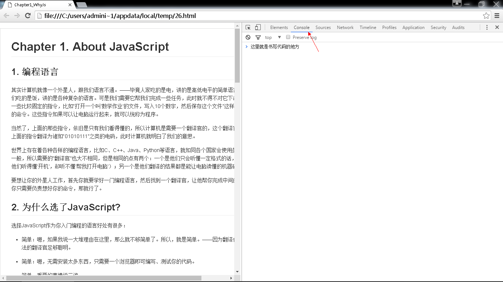

#Chapter 1. About JavaScript

##1. 编程语言 

其实计算机就像一个外星人，跟我们语言不通。——毕竟人家吃的是电，讲的是高低电平的简单语言，而我们吃的是饭，讲的是各种复杂的语言。可是我们需要它帮我们完成一些任务，此时就不得不对它下命令，用一些比较固定的指令，比如“打开一个叫‘数学作业’的文件，写入10个数字，然后保存这个文件”这样一系列的命令。这些指令如果可以让电脑运行起来，就可以统称为程序。

当然了，上面的那些指令，依旧是只有我们看得懂的，所以计算机是需要一个翻译官的，这个翻译官负责把上面的指令翻译为诸如“01010111”之类的电码，此时计算机就明白了我们的意思。

世界上存在着各种各样的编程语言，比如C、C++、Java、Python等语言，就如同各个国家会使用多种语言一般，所以需要的“翻译官”也大不相同，但是相同的点有两个：一个是他们只会听懂一定格式的话，（比如他们听得懂‘开机’，却听不懂‘帮我打开电脑’）；另一个是他们翻译的结果都是能让电脑读懂的机器码。

要想让你的外星人工作，首先你就要学好一门编程语言，然后找到一个翻译官，让他帮你完成中间的工作，你只需要负责想好你的命令，那就行了。

##2. 为什么选了JavaScript?

选择JavaScript作为你入门编程的语言好处有很多：

 - 简单：嗯，如果我说一大堆理由在这里，那么就不够简单了。所以，就是简单。——因为翻译你那些想法的翻译官足够聪明。

 - 简单：嗯，无需安装太多东西，只需要一个浏览器即可编写、测试你的代码。

 - 简单：重要的事情说三遍。

>  “……哼，我倒觉得越是简单的东西越容易让人掉坑。（像我就不简单）”


##3. 现在需要什么？

一台电脑，一个记事本或者其他文本编辑器，一个比较新的浏览器即可。

当然，我更推荐的是Google Chrome为代表的浏览器，如FireFox、Fedora、甚至是套用WebKit换皮的360浏览器，而不是推荐IE。

——因为前者的功能更加完善，而且能智能地补全代码，识别错误；而后者需要靠肉眼看，脑补结果，用玄学占卜找到错误。


*ps:后期遇到较长的代码时，我建议是找一个靠谱的文本编辑器进行编写，比如Sublime Text。*

##4. 最后，开始了吗？

是的，开始了。点开你的浏览器，然后在菜单中找到“开发者工具”:


当然，如果你喜欢快捷键，那么就应该了解一下，不同的浏览器菜单稍有不同，但是快捷键是基本相似的：

 - 如果是Chrome之类的浏览器，只需要用快捷键Ctrl+Shift+J即可呼出开发者工具中的控制台，也就是你编写代码的地方。
 - 如果是IE 9.0以后，则按F12即可。但是不推荐这个让人抓狂的浏览器，真的。

不管用什么方式，现在，此时你应该可以看到一个类似这样的界面：
	


在弹出的界面中，有很多实用的工具，但是现在我们只需要关注其中的“Console”标签页，如果你不是在该标签页上，请切换一下即可。这里，就是我们目前书写、运行代码的地方。

Congratulations！

你终于可以开始我们的第一句代码了，按照国际惯例，让我们在上面写一句问候语吧：

```js
alert("Welcome to playground!");
```

会出现什么结果？尽管按下回车键，看看运行结果吧！如果没有任何结果，看看哪里出错了？拼写？还是误用了中文符号？
*注意上面的符号都是英文的。代码新兵往往会不经意间就输入中文状态符号而引发令人手足无措的错误。*

##5. 结语
最后那句话为什么这么写？究竟发生了什么？保留你的疑问，这些都是准备工作，我们即将开始真正的征途。
