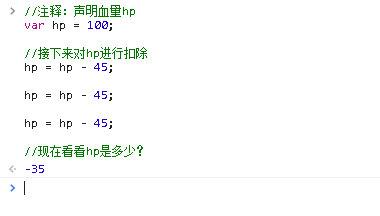

#Chapter 2. 你的名字是？

##1. 回顾
第一章里，我们写了第一句问候语，让浏览器弹出了一个弹窗问候我们（怎么感觉“问候”这个词已经变歪了）：

```js
alert("Welcome to playground!");
```
认真观察这句话，你会发现有很多关注点值得注意：
首先，alert是一个有含义的单词：警告。其实就是弹出一个“警告框”，不过由于年代更迭，浏览器已经不会很大声地播放一声警告声，然后弹出一个吓人的警告框，而是一个友善的提示框。

那么，警告框里的内容是什么？双引号里的内容就是啦，就跟作文里，谁说了哪句话，我们都会用双引号包裹一样。

最后，在程序里，你每说完一句话，就要用**英文状态下的分号“;”**结束这句话。——类似于我们用句号来结束一句话。

这里有个有趣的地方：由于分号才是结束一句话的标志，所以你可以写一句花式代码如下：

```js
alert
(
"Welcom to playground!"
)
;
```
*当然，不要告诉我你喜欢写这样风骚的代码。*


##2. 你的名字和“你的名字”？
    我低着头在街上行走着。
    “那个，站住！”民警同志叫住了我。
    “干、干嘛？”
    “你的名字是？”民警同志拿出了一个硬纸板，准备登记。
    “我的名字是‘咸鱼’。”我回答说。
    “这人的名字：‘贤余’。”民警同志点头，“好了，你可以走了。”

那么，问题来了，当警察问我的名字时，他想知道的是什么？当然是“我的名字的具体值”，而不是一个叫“名字”的东西。看似很钻牛角尖的事情，却会对消除歧义有很大的帮助。

现在继续我们的故事……

    民警同志看到我离去的背影有点鬼鬼祟祟，还是不放心，一把拉住我：
    “同志，来来来，报出你的姓，说出你的名，生辰八字都要有，让我好好来登记。”
    我突然觉得这警察是不是唱Rap要跟我Solo的……汗。
    如实汇报：“其实我是曾xx，1989。”
    民警同志很用心地工作，在表格上写下如下内容：
    姓名： 曾xx
    出生年月： 1989
    年龄： ……？

那么问题来了，如何重现上述的过程？

具体可以表述为：电脑里如何存放民警同志需要的数据？如何更改数据？如何操作运算？


算了，咱们就忽略这个背景故事，把这个当做稍后的思考题吧。

直接下一节吧。

（可别把我拉出去胖揍一顿……）

##3. 声明变量：游戏开始

首先，让我们假装进入了一个虚拟的游戏世界，按照惯例，电脑会问玩家的名字。那么，电脑里总得有个地方存放玩家名字吧？

此时，就需要一个叫做“变量”的东西。变量，顾名思义，就是会变的量。

变量会被存放在电脑的某个地方，就跟表格上的某一栏类似，我们可以说第3栏填入“赵xx”作为玩家的名字，这是可行的；但是由于电脑里的存储太大了，可存放的数据比仓库还大，我们如果用“21区32块第602391格的地方”来描述这个地方的话，估计没多少人会记住下一格是存放什么。

所以，我们更喜欢用别名来查找变量及其具体的值。——同样跟民警叔叔手里的表格一样，我们也可以说在“姓名”那一栏填入“赵xx”。

那么，我们的变量也要个名字才行。

好了，现在我们需要一个叫做玩家名字的变量，用来存放玩家名字“Hero”。（看吧，就跟上面一节的章节名一样绕口）

```js
var playerName = "Hero";
```

回车完成这一句输入。

这就行了？对！现在，你可以用不成文的语法来询问电脑，playerName的值是什么？

输入：

```
playerName
```

运行，即可查看具体playerName的值。当然，这一句是不成文法的，只不过浏览器支持通过只输入变量名来查看该变量的值。

这下，你理解了变量是什么了吧？

不过需要注意，变量的声明方式是: 

>var 变量名;			//var 是 variable的意思，也就是变量单词的简写，代表向电脑要了一个存储的东西。

而且要求变量名必须是连续的，不能有空格，而且不能以数字开头（因为用数字开头更让电脑困扰，var 13是在定义什么呢？）。为了能看清楚两个单词组合起来的变量，这里采用了后面的单词Name为首字母大写的模式。

此时，playerName = “Hero”。如你所见，我们在一开始就给该变量赋予了一个值，嗯……你要是不喜欢，还可以只声明而不赋值，如：

```js
var playerName;
```

不管你给不给值，都在告诉电脑，你需要一个变量用来存放某些东西。在JavaScript中，并不区分变量的类型，这一点跟其他严格的编程语言有所区别。

*所谓变量类型，就类似于你要表格时，需要的表格栏有多长；在电脑里变量类型就决定了存放的地方要有多大。
当然，如果你学到了一定境界，就会知道让浏览器自动推导你要的类型是不够快的（至少在毫秒时间上有差异）。不过现在，管他的呢。*

##4. 操作变量：算出出生年月？

现在，电脑已经能知道玩家的名字了，接下来，就是该知道玩家的……出生年月了。

——“出生年月是什么鬼！不应该是玩家的血量之类的吗？”

哦，这是一个出生年月决定血量的游戏。嗯，同样，咱们来练习一下数字变量的操作吧：

```js
var birthYear = 1993;			//这是注释：声明了玩家的出身年代
var currentYear = 2017;			//声明了当前的年代
var playerAge;				//声明一个变量用于存放玩家的年龄

playerAge = currentYear - birthYear;	//计算玩家的年龄
```

如你所见，上面的语句，每一句在后面都有注释，注释用“//”作为起始符号，并不会被执行。当然，现在的重点在于真正的语句。

我们这里声明了三个变量，前面两个都赋予初值，第三个展示了不赋值的写法。

最后一句，则展示了计算的方法：用当前的年代，减去玩家出生的年代，即可算出玩家的年龄，是不是很聪明？

呃，好像这样是算周岁的？那么就把最后一句改成：

```js
playerAge = currentYear - birthYear +1 ;	//计算玩家的年龄
```

简单吧，这就是数学运算，而且就如同小学的算术一样，而且优先级是对应的，就是说复合运算时，谁的优先级大就算谁，而不会像简单计算器那样逐一计算。

运算符号加减乘除分别是：
 - 加号： +
 - 减号： -
 - 乘号： *
 - 除号： /
 - 取余： %

这里唯一特殊的符号，可能就是取余了。所谓取余，就是取除法操作时的余数。例如对于：
```
13%4
```
相当于用13÷4=3...1，余数为1，也就意味着
```
13%4=1
```

现在，你应该尝试一下直接在控制台里编写一道长长的等式，熟悉一下运算规则，同时熟悉一下变量的操作。
```js
//比如你可以尝试心算一下以下代码：
var result = 1987;
result = result - 2009;
result = result + 19 * 2;

//结果会是多少？如果你能心算出来，代表着你对变量已经掌握了不少了~
```

最后，民警叔叔可长吁一口气，因为他应该也知道怎么利用电脑计算我的年龄了。


##5. 练习模式：勇者的冒险

现在，终于可以给勇者决定血量了，但是你想要的肯定不止如此。我们还想模拟勇者的饥饿行为：生命从100开始，每次由于饥饿而扣去45点（这样可以尽快让勇者饿死了。）：

```js
//注释：声明血量hp
var hp = 100;

//接下来对hp进行扣除
hp = hp - 45;

hp = hp - 45;

hp = hp - 45;

//现在看看hp是多少？

```

那……你看到了什么？负数！


当然，我们不想有负数的出现，最低我们只允许0的出现，不过现在我们还束手无策，不知道怎么处理。


---

## Q&A: 提问时间

回答问题的内容可能会稍微扩展，所以即使部分看不懂，甚至跳过这部分也无关系。记住：这里只是扩展阅读区而已。

### 1、变量名在再次定义之后，就会以最近的一条定义为准对吗？（怎么追溯历史呢？这个可能以后会教？）

是的，不过还是要看定义所在的“范围”（术语称为：作用域），在不同的地方定义相同名字的变量，可能会覆盖不同的定义。在后面的学习中，我们可能会遇到这种情况：
```js
//1.这里声明了一个变量name
var name = "AAA";

//下一行是一个方法声明，后续章节会讲到
function ChangeName()
{
    //2.尝试覆盖name：
    var name = "Super Man";  //又声明了一个name
}

//然后执行这个方法：就是会执行上面的方法内的语句
ChangeName();

//再看看name还在否：
alert(name);

//3.重新声明一个变量：
var name="BBB";

alert(name);

```

复制以上的这段代码，到控制台执行，你会看到结果是：

“2.”处声明的变量并没有覆盖到name，因为它所在的是一个别的作用域；

但是“3.”处的声明恰恰好能覆盖掉name，因为它跟“1.”的所在区域是一样的。

可以这么理解：
历史上，在秦朝，秦始皇定义了首都为“咸阳”，此时，相当于：

```
var 首都 = "咸阳";

//此时百姓去问秦朝首都是什么值的时候，会得到”咸阳“的结果
alert( "秦朝首都是？答："+首都 );
```

而后，汉高祖定义了长安才是首都，此时相当于一个新的定义：
```
var 首都 = "长安";

//--此时结果可想而知了，之前的定义被推翻了。
//此时百姓去问秦朝首都是什么值的时候，会得到？
alert( "秦朝首都是？答："+首都 );
```

需要谨慎对待的是，覆盖就意味着之前的结果会消失不见。比如刚刚我们把历史上的首都给篡改了，秦朝有首都，曰“长安”，这就是不可容许的篡改历史行为了。

所以，我们需要用其他方法来防止变量名覆盖。

比如，我们可以指定一个规则：声明变量时注意用尽量合适的不冲突的短语，比如：

```js
var 秦朝首都; var 汉朝首都;
```

当然，也有其他方法，这里不展开。

### 2、我发现写代码的时候不用分号也可以，换行就行了，用分号是不是有什么意义？

是的，分号有意义，就如同你在上面的那段代码中，看到我一句话连写了两个声明了吧？但是这是两句话。

分号于程序，就如同句号于文章。一句话写完了，就用句号结束。一段代码写完了，就用分号分隔。

当然，逗号的意义于文章、于代码，意义就差不多了，比如下面这段，就用一个var声明了两个变量，这也是合理的哟：

```
var 秦朝首都,汉朝首都;          //注意：逗号是英文状态下的逗号
```


但是，说了这么多，为什么代码不用分号也可以？因为我说过了……js足够智能。

>
>就如同
>我这句话 
>不连一起 
>的话 
>你也看得懂
>

之前的代码中，你不加分号，而是用换行来表示某一句代码的结束，对于js来说，是可接受的，负责翻译你的代码的家伙知道你的话还没写完，所以会判断哪里才结束。

你甚至可以很过分地花式写代码如下：

```js
var 
        x
            =
                108

alert(x)
```

但是js并不是那么足够智能，有一些特例会出现意外，比如将下面这段话整段复制到控制台中运行，会得到一个错误：

```js
var x , y
y=x
(1+10)

```

但是你加了分号，或者分别复制、粘贴每一行运行，却是没错的。奥妙就在于：括号会让js觉得，你的话是还没结束的，上面的代码会被识别为：
```js
var x,y;
y=x(1+10);
```

所以，就严谨性而言，使用分号是最保险而且最好的代码风格之一。

写分号的另一个显而易见的好处在于，后期可以将代码的格式进行压缩，可以更省存储空间，和网络传输所消耗的流量。

在大型的网站文件中，一万行的代码文件可能并不少见，而里面大部分可能都是缩进、空格、换行符等格式符号，所以通常会去除这些格式符号以减少文件大小，最终文件会变成一行超长的代码。此时分号的作用就特别明显了：没有分号，这行代码可能就报废了。


### 3、定义有公式的变量可以直接在定义里写，分开写是不是代表每一行越简洁越好？

是的，简洁至上，而且更符合阅读习惯。不过不同的情况，有不同的方式。比如追求简洁的时候会有这种情况：

```js
var x;

//很多代码都没用到x...

x= x*20;

```
此时可以选择把var x写到下面，而不是在一开始声明。

但是，需要着重注意的是，**上述的代码习惯更符合阅读习惯，也符合一条重要的规则：先声明，再使用。**在一块集中的地方声明一些必要变量，是一种好习惯，同时也会规避js的一些特殊问题，比如js的进阶话题：声明提前。

对于变量初始值是否要给出，就看情况而定，代码这事，写多了就明白了。

