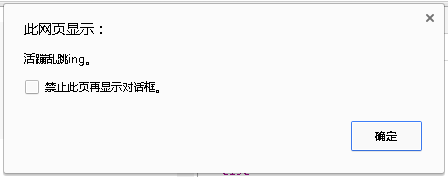
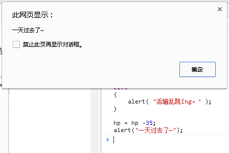
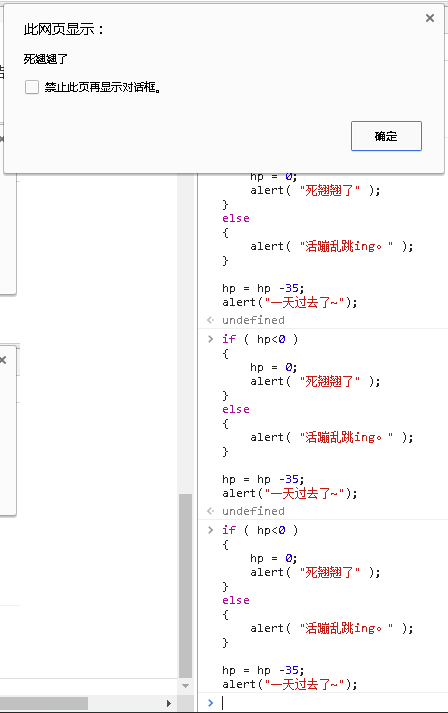

#Chapter 3. 如果你饿了，何不来点吃的

##1. if...what?

在前面我们遇到了一个不小的问题：玩家血量低于0的时候，我们不知道如何处理。至少，应该弹出个窗口，告诉玩家血量太低，所以挂掉了吧？

那么，来整理一下思路吧，我们的想法是：

```
如果 血量 低于 0 那么 血量=0;
```

你看，这样的表达似乎没有什么问题，对于单条的语句来说，这也是成立的。

可是考虑一下这样的处理过程：

```
如果玩家的血量小于0，那么让血量=0，弹出一个窗口告诉玩家“游戏结束”。
```

在“那么”后面，可是有不止一条语句的情况，又该怎么告诉电脑，后面的那句话也是属于条件满足的情况下才执行的呢？

那就找个符号包裹一下我们的话吧，比如用成对的花括号“{}”。这样一来，我们连“那么”两个字都可以省下了：

```
如果  血量 小于 0 
{
	血量=0;
	弹窗("游戏结束!");
}
```

啊哈，代码如此简单！

让我们在之前的代码后面写一下真正的判断代码吧：

```js
//之前的代码
var hp = 100;

hp = hp - 45;
hp = hp - 45;
hp = hp - 45;

if ( hp < 0 )
{
	hp = 0;
	alert("Game over!");
}

```
*如果你是直接在浏览器的控制台里写代码，你会发现你写不了上述的末尾三句话，因为它们是连贯的。所以你有两种解决方法：用Shift键+回车键进行换行；或者先在记事本里面写好末尾的几行代码，然后拷贝、粘贴到浏览器控制台中运行。*


看吧，到了这里你应该读懂了。如你所见，想要说明的条件应该放在括号里面，而满足条件的代码则放在花括号里面，格式就是：

```
if ( 条件 )
{
	满足条件时执行的代码;
}
```

那为什么条件要放在括号里？因为括号能指示条件范围。没有括号的话，如果有多个条件就不知道该怎么写了。所以，你就稍微记一下下：括号包裹条件。

##2. else?

那么，在勇者生命值没见底的时候，想输出其他的话，怎么办呢？那好办，就是归纳于其他情况呗。为了说明if的情况，我们需要先让勇者的生命值重新设置为100：

```js
hp = 100;
```

接下来的代码有一整段需要运行，所以需要先在记事本或者在其他文字编辑器里**输入如下整段的语句**：

```js
if ( hp<0 )
{
	hp = 0;
	alert( "死翘翘了" );			//注意双引号是英文的双引号哦
}
else
{
	alert( "活蹦乱跳ing。" );
}

hp = hp -35;
alert("一天过去了~");

```
而后，将写好的这段代码复制、粘贴到控制台上运行，你得到了什么结果？

首先弹窗：


点击确定后，会继续弹窗如下：


由于运行的时候，勇者的生命值是满满的，所以不满足if的条件，而执行了else部分的内容；

而后面的扣除生命值部分，则算是公共的部分，而不管if哪部分被执行了。为了理解这段话，你需要再次粘贴上面的代码再运行一次，然后再粘贴，再看结果。如果不出意外，勇者会死翘翘，但是地球依旧在转，时间依旧会过去一天~



 “……死……死翘翘了？”

##3. and ?

截至目前，你已经学会了if的简单表述，同时也把勇者玩死了两次。不如这样，咱们再把勇者复活了吧？不过这次可不能那么简单地操作hp=100就可以了，我们需要加多一个条件：想要复活，必须要生命低于0，并且金钱大于100才能复活。

首先，写下面一句代码，以设定勇者的金钱：

```js
//先给勇者金钱吧：
var money = 100;
```

然后，让我们来再添加“并且”这个条件吧，怎么表达并且？用两个"&"（读作and）符号即可：

```js

if( hp <0 && money > 100 )
{
	alert("金光一闪，勇者复活了！");
}

```

在记事本写好上述代码，复制到浏览器控制台，回车运行，你得到了什么？

什么事情都没发生！

为什么！？

代码没有错，完全没有错。想法也是对的，但是就是没弹窗，难道是中毒了？

对，你的电脑中毒了，赶紧打开杀毒软件查杀一下什么问题吧。本节结束。

##4. 查杀bug

是的，现在是查杀bug时间，所谓bug，就是写程序的人，也就是你，在写程序时没考虑到的一些隐含条件而由此引发的问题：比如一些老式的烧水壶不会检查水量有多少，在没水的情况下直接会把自己烧干。

那么，我们考虑什么考虑不周了？

先看看勇者的hp是多少？金钱是多少？

如果没猜错，目前勇者的生命值为0，金钱值为100。那么问题又来了：

> 0<0吗？100>100 吗？

对的，0不大于0，也不小于0，而是等于啊！金钱的判断也同理。所以，我们写的条件：

> 如果生命值<0 并且 金钱> 100

两个条件都不满足！

大意了。那么怎么表述“大于等于”？

很简单，就是“>=”；小于等于则是“<=”，多直观。

然后，你会理所当然地认为，当你需要判断一个数是否等于具体一个值的时候，是使用这样的语句：

```js
if( hp = 50 )
{
	...代码...;
}

```

这样对吗？当然不对。因为你还记得我们是怎么操作变量的吗？现在if里面就是在操作变量，而不是在判断条件。真正的写法是：

```js
if( hp == 50 )		//注意，用的是连续的两个等号！
{
	...;
}
```

至此，我们的代码也就应该可以改正问题了，将if里面的条件稍作修改，就可以了。

###5. 阶段性总结

所谓学而不总结则罔，那么现在我们学了什么呢？

 - 变量的声明： var 变量名;

 - 变量的操作： 变量名 = 数值/"一段文字";

 - if条件的判断： if ( 条件 ) { 某些代码; }

if条件的表达式可以为：

| 条件     | 表达式         | 备注                                             |
|----------|----------------|--------------------------------------------------|
| 大于等于 | a >= b         | 左右两边应该是可比较的值，如变量、数值、甚至文字 |
| 小于等于 | a <= b         | 同上                                             |
| 等于     | a == b         | 等号是连续的，分开了就是语法错误了               |
| 并且     | 条件a && 条件b | 同样，符号是连续的，意思是要两个条件同时成立才行 |
| 或者     | 条件a || 条件b | 意思是任一条件满足即可，如a成立而b不成立也可以   |

###6. 最后的最后

最后，你会想起来我们上面有很多重复执行的语句，比如每天重复度过时，勇者的生命值在慢慢减少之类的。如果你不想重复复制粘贴大段大段的代码，就会想做以下任一一件事来完成这些重复的工作：

1. 把这些成段成段的代码整合成一个小“功能”，嗯，就像把一系列的动作统称为一个方法一样。比如在日常生活中，有以下动作：
```
	敲碎一个鸡蛋；
	拿出一个碗；
	将鸡蛋蛋清蛋黄盛到一个碗里；
	拿出筷子；
	用筷子不断地搅拌蛋清和蛋黄；
	如果蛋黄蛋清已经充分混合，停止搅拌；
```
	我们会统称为“打蛋”。如果你的妈妈叫你去打蛋，她只需要说两个字，而不是说出以上6条命令即可。这就叫把代码整合成一个“功能”的过程。

2. 将重复的行为放进一个“循环”，这样就可以控制重复行为的次数。比如我们想让勇者不断扣血扣十次，那么就应该放到循环里而不是复制十次这样的代码。
当然，循环可以完成的动作不止这些。只不过我们就到此为止了。


