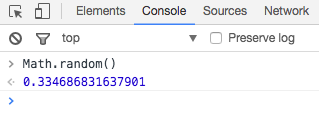
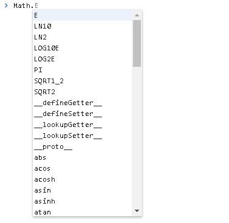

#Chapter4. 杀死勇者的方法
##1. 谈谈上一节的“方法”

上一节中，我们已经让勇者无辜地牺牲了。（尽管我们增加了复活的行为，但是并没有成功复活之）现在，我们只能哀悼一下，然后追忆一下我们在勇者死去的时候的提示代码是什么？

```js
alert ( "Game over!" );
```

我们来重新审视这句代码，像不像我们上节说的“打蛋”行为？言简意赅的“alert”其实就是一个方法，该方法由JavaScript倾情提供，内部其实包含的远多于我们想象的“敲开蛋壳、倒出蛋黄……”这样的行为。

不过不管怎么说，你已经知道了怎么使用方法了，不是吗？

假如有人已经提供好了一个“计算圆面积”的方法，你就只需要告诉他：请计算半径为5的圆面积，他就会哼哧哼哧地进行各种计算（而你不用关心计算的细节），而后他就会告诉你：面积是……

在数学上，这一计算的公式可以称之为函数。而我们不想让自己的脑子里充满各种术语，比如函数调用、函数声明等等，所以我们就将之看做“方法”吧。

*如果想深究函数的话，我们可以这么去看：在数学中，我们会定义一个函数为：f(r) = r * 3.14。 此时f就是函数名，类似于我们的alert，r是传入的变量。调用这个函数，你就可以获得你想要的圆的面积了。*

啰嗦了这么多，不如让我们先试试其他的方法，体会一下“方法的调用”先吧。

>  “方法？不就是给一些行为做个统称么？就好像我说我‘跳舞’，其实就是我在‘左摆摆、右摆摆、眨眨眼’的统称哈。”


##2. 体会方法的调用： 你会扔骰子吗？

不管是在应用程序、网页、还是游戏当中，都离不开一个重要的“函数”，那就是——随机数！

在前面的扣血行为中，我们让勇者的生命值是确定地减少的，每次减少35点生命。可是这样确定性的行为有什么值得紧张的呢？

所以我们希望来一点刺激的：勇者会每天减少10~50点生命值，这样一来，他就会诚惶诚恐地度过每一天了，谁知道他是能活两天，还是五天呢？

不过稍安勿躁，我们有了目标之后，还是要先打好基础，怎么调用随机数？

随机数由一个叫Math的家伙掌控着，也就是说，只有通过Math（数学），才能调用到生成随机数的方法。先试着在浏览器的控制台中输入：

```js
Math.random( );		//可以大声读出来：“调用Math的随机数函数”。
```

你得到了什么结果？在我的浏览器中的运行结果如下：



你可以尝试多运行几次，就会发现你获得的数值是不一样的，这就是随机数。唯一的问题是——随机小数并不是我们想要的，怎么办？random( ) 会生成一个从0~1（但不会是1）的数值啊。

有了，乘上50 不就好了？比如这么写：

```js
Math.random( )*50 ; 
```

就可以生成从0到50的……随机小数了。

(╯‵□′)╯︵┻━┻： 什么鬼，还是小数，我不要小数啊。

别担心，Math是强大的，它里面还藏有很多的工具。比如：

| 方法			| 功能				| 范例			|
|--------------------------|-----------------------------------|--------------------------|
| Math.round( )		| 对小数取整，四舍五入		| Math.round (3.6) = 4	|
| Math.floor( )		| 取整，直接舍弃小数部分	| Math.round (3.8) = 3	|
| Math.ceil( )		| 向上取整，只要有小数就进位	| Math.ceil     (3.1) = 4	|
| Math.abs( )		| 取绝对值			| Math.ceil     (-3 ) =  3	|

当然，如果你想知道还有其他什么工具，也可以自己探究，只需要在控制台输入的时候关注一下自动提示即可，比如我只需要输入
```
Math. 		//后面有点号
```
即可呼出自动提示，如图，上下键即可选择候选的方法：
 
---
> 这就是现代浏览器的强大之处啊！

有了取整，此时随机数可以看起来真的很“随机了”，不信可以试试这么写：
```js

//调用random方法，生成一个随机数（带小数）
var randNum = Math.random() * 50;

//--再对randNum取整
randNum = Math.round( randNum );

//--输出看看：
alert(" 随机数: " + randNum );


```

//当然，上面的这么多句，可以合并写成以下形式（不要问我为什么，因为这样很酷，但是不太简洁）：
```js

var randNum2 = Math.round( Math.random()*50 );
alert( "随机数：" + randNum2 );

```

相比于变量的语法，总结一下之前的“方法”的使用规律，你发现了什么？嗯，括号，括号！正是括号的出现，让方法对应的英文单词能够跟变量的单词区分开来。

比如对于输入 **alert = 10**， 你现在一定能知道这 **alert** 其实是个变量，只不过名字恰巧是“警告”，而对于输入**alert( )**，你就可以知道这是在调用alert的方法：弹出一个对话框！

至于括号内的东西，其实就是给这个方法的“原料”，术语叫“参数”。当然，并不是所有的方法都需要参数。

总而言之，调用方法的语法是：
```js
方法名 ( 参数 ) ;
```

>如果把方法比喻为榨汁机的话，那么参数就相当于原料：
>你给豆浆机加入不同分量的原料，出来的可能是或粘稠的或稀稀的豆浆。
>你给苹果榨汁机加不同分量的苹果，出来的可能是一杯苹果汁，或者三杯。
>但是可以肯定的是，你给榨汁机加入石头的话，那么这部机器一定会爆炸。
>但是你的电脑不会，只会报错：参数不符。
>*——语自JavaScript编程大师 尼古拉耶维奇·奥斯特洛夫咸鱼*

最后，需要说明的是，使用“方法”要得当：参数要类型能够匹配。不然你尝试对一段文字进行“取整”的话，你只会遇到红色的报错信息。

##3. 勇者悲惨的命运： 再度失血

现在你已经知道我们要做什么了。对，扣血！而且这一次是把之前扣血的一整套流程“扣血、判断死亡与否”写到一个方法里。

定义一个方法的很简单，跟我们声明一个变量的格式差不多，唯一区别的，可能就是后续的代码了吧，格式如下：

```js

function 方法名 ( 这里可能有参数，也可以没有 )
{
	//看到上下的花括号了吗？也是包裹方法范围的哟。
	//某些代码;
	//某些代码2;
	//blabla...
}

```

现在，让我们动真格的，综合之前的所学，来声明一个扣血的方法吧。(为了学习方便，可以重新打开一个新的页面，不会因为保留太多之前声明的变量而造成困扰)

```js
//先重新声明勇者的血量，100点血量：
var heroHP = 100;	

//声明一个方法（或者叫“函数”），用于受到伤害时的扣血
function TakeDamage()
{
	//将要被扣的血：这里限制在30以内的随机数
	var randHP = Math.round( Math.random() * 30 );
        
	console.log("呜……勇者受到"+randHP+"点伤害！");

	//扣血
	heroHP = heroHP - randHP;
	
	//看看勇者生命值是否为负值，是的话输出游戏结束
	if(heroHP <= 0)
	{
		console.log("游戏结束了！勇者已经死翘翘了！");
	}
	else
	{
		//--否则的话，输出目前的HP
		console.log("现在HP: "+heroHP);
	}
}

//现在，终于可以试试使用这个方法了！让他受到伤害看看！
TakeDamage();

```

在文本编辑器或者在控制台写完以上代码，看看效果？

##4. 勇者也要典当物品：带参数的方法

如果你足够细心，会发现这次我们的输出语句换了，不是吗？对的！换了叫做日志输出的方法"log()"，而不是"alert()"。它们都是输出信息的重要方法，只不过……你真的喜欢频繁的弹窗程序？我反正是不喜欢的。静静地在控制台输出一些信息，这就是log()的功能。哦，还需要知道的是，log()是属于控制台console的一个方法，所以是写成了console.log()。

现在，你只需要使用TakeDamage(),就可以让勇者心惊胆战地扣血了，一旦血量为负，还会输出“游戏结束！”。方法真简单，不是吗？

但是方法远不止如此。之前怎么说来着？方法其实就如同豆浆机一样，你倒入原料，它就可以产出一大杯豆浆给你。上面的方法里，我们不需要原料，也不需要什么东西返还。现在，让我们假设勇者有点困窘，不得不去找商人卖自己获得的物品，以此演示更高级的“方法”的用法。

现在假设这个方法叫做“卖物品”。一旦执行这个方法，就可以卖掉身上一定数量的物品，然后获得对应数量的金钱。另外，我们还需要一个计算物品价值的方法，这个方法会返回最终的价值，这样商人才知道要给勇者多少钱。多说无益，看看代码是怎么写的：


```js 
//勇者的金钱、与物品数量
var heroMoney = 80;
var heroItem  = 5;

//卖东西的方法：
function SellItem( itemCount )		//注意这里可是有个参数，叫做itemCount的哟！
{
	console.log("------------------------------------------------");
	console.log("商人：欢迎欢迎，我的勇者！	");
	console.log("你身上拥有的金钱：" + heroMoney + "拥有的物品：" + heroItem );
	console.log("你想卖出的数量是：" + itemCount);
	
	//检查数量：如果超出勇者持有的数量，则中断方法
	if(itemCount > heroItem)
	{
		console.log("……你身上的数量似乎不够卖给商人了。");

		//返回
		return;
	}
	
	//嗯……让我们看看这些物品值多少钱：
	var itemValue = CalculateMoney ( itemCount );

	console.log("嗯……这些值：" + itemValue);

	//给勇者的钱加上：（注意以下写法其实等同于之前的 a = a + b 形式）
	heroMoney += itemValue;

	//扣掉勇者的物品数量：
	heroItem -= itemCount;

	console.log("现在，你身上拥有的金钱：" + heroMoney + "拥有的物品：" + heroItem );

}

//计算物品价值的方法：
function CalculateMoney( itemCount )
{
	//计算对应数量的商品总价值是多少：这里假设单价为25块钱
	var totalValue = itemCount * 25;

	//返回价值
	return totalValue;
}
```

好记性不如烂笔头，看代码不如敲代码。赶紧写出上面的代码。

现在所有该有的方法都声明了，我相信相对于方法的声明，你更熟悉方法的使用：

 - 超出数量的时候会发生什么
> SellItem(20);


- 正常卖的情况下：
> SellItem(3);


- 还有一个非常可怕的调用:
> SellItem(-3);


你看懂了我们做了什么了吗？哦，加入了参数，还有返回值。现在概括而言，方法的定义应该是这样的：

```js 

function 豆浆机 ( 豆子数, 糖 )
{	
	//……处理代码

	return "放了"+豆子数+"斤豆子做成的热腾腾的豆浆制作完成了！";

	return "接下来，你还想要什么？";
}

豆浆机(10);  //这里却只用了一个参数，是“不良好”的代码

```

哦，不好意思，放错了。（这里应该放一张尴尬的表情。然而，上面的代码是可运行的，你可以复制到新的控制台试试看效果，加深某些语句的理解)

方法的定义应该是这样的：

> function 方法名 ( 参数 )
> { 
> 	...处理代码
> 	可能有return,也可能没有。
> }

在上面的售卖物品的函数中，我想你应该知道了很多内容：

1. 不同方法的同名参数是互不影响的：你应该看到CalculateMoney()方法里有个参数名叫itemCount， 而SellItem()方法里同样也有这个名字的参数。之所以我们叫这些变量为“参数”，就是为了跟之前的概念区分开。参数是在方法内有效的，也就是说，参数itemCount的作用域仅仅在对应方法内，不同方法的参数itemCount并不会互相影响。这就类似于……北京有个打铁匠叫“李师傅”，南京有个开车的也叫“李师傅”，同名，但是他们并不相同。

2. 方法是可以返回一些值的，或者直接打断该方法。在上面的售卖物品的方法中，你应当注意到，一旦勇者试图售卖20件物品，而他身上只有5件，该方法就会提示数量不足，并且不再往下执行计算金钱、给钱之类的操作。其中的奥妙之处，就在于
> return;

一旦方法执行到return ，就会中断这个方法，然后返回对应的内容（或者没内容）。

当然，你也可以返回你想要的变量、数值、或者文字内容（也叫字符串）

3. 方法可以先使用，再声明。如果你学过些许的C语言，你就会感到困惑：为什么SellItem()方法里用到了的方法CalculateMoney()并没有在之前被声明？没声明的东西，js还认识得出来是什么吗？？？当然，js代码里，你可以先使用一个方法，然后再在某个地方声明这个方法的具体内容。（如果你对具体的实现机制有强烈的兴趣，可以参看《JavaScript权威指南》）

4. 参数可能是不安全的，最好的方法，就是检查方法的参数。如你所见，我漏掉了售卖物品时对物品数量为负的情况下的检查，这就导致了一个bug：你可以卖负数个物品！所以，你知道该怎么做了吧？


##5. 更高级的方法：震惊！日子一天天过去，勇者竟然持续掉血！

那啥，我们的这一节主题是什么来着？优雅地实现勇者“被掉血”。现在我们已经能让勇者随机掉血了，但是，我们这样就满足了吗？不！勇者必须掉血，掉血，掉血。——我们的口号是，找到更好的方法，让勇者持续地掉血！

尽管我们会想到使用“循环”，不断地执行TakeDamage的方法，以实现我们的想法。但是，这一节是“方法”的个人秀，所以不如换个思路：

我们的日子每天结束后，就会开始新的一天。

勇者的世界里也如此。只不过他的日子现在不太好过：今天会持续地掉血，今天结束后，又开始执行今天的方法，以实现“明天”。实际上，今天不就是昨天，明天不就是今天？——如果这个描述让你陷入了对人生意义的思考，请赶紧打断，让我们看看可怜的勇者怎么坚强地活下去吧。

> 勇者：“打断一下，打断一下，请问为什么我要遭这种罪啊！我为什么会每天持续地掉血！”
> 旁白：“……因为你没吃饭，每天过去，你肯定会少生命值啊笨！你以为在游戏里就不用吃饭了吗？扣你那么点血已经是仁至义尽了好不好！”
> 勇者：“……好吧，记得复活我。”


好的，现在先声明一个叫NewDay()的方法，看看方法的高级用法——

```js 

//一如既往地，声明HP、TakeDamage( )
var heroHP = 100;

//这里的方法声明跟前面一致，想多练的可以跟着再敲一次
function TakeDamage()
{
	//将要被扣的血：这里限制在30以内的随机数
	var randHP = Math.round( Math.random() * 30 );
        
	console.log("呜……勇者受到"+randHP+"点伤害！");

	//扣血
	heroHP = heroHP - randHP;
	
	//看看勇者生命值是否为负值，是的话输出游戏结束
	if(heroHP <= 0)
	{
		console.log("游戏结束了！勇者已经死翘翘了！");
	}
	else
	{
		//--否则的话，输出目前的HP
		console.log("现在HP: "+heroHP);
	}
}

//这里多声明一个函数，用于检查勇者是否已经死掉了：
function IsHeroDead( )
{
	return heroHP <= 0 ;
}

//新的一天：
function NewDay()
{
	console.log("------------------------------------------------");
	console.log("新的一天开始了！");
	console.log("勇者肚子开始咕噜噜叫了起来：");

	TakeDamage( );

	if( IsHeroDead( )) 		//效果等同于if ( heroHP <= 0 )  ：如果看不真切，可以对照上面的方法内容进行查看。
	{
		console.log("勇者已经死翘翘了……游戏结束。");
	}
	else
	{
		console.log("一天结束了……");
		console.log("------------------------------------------------");

		//请睁大眼睛看看这里使用了方法自己本身，超高级的用法：
		NewDay( ); 
	}
}

```

现在，所有需要的方法都已经声明结束，你能猜到结果吗？只需要运行：

```
	NewDay( );
```

你就可以看到刷的一下，一大串文字会出现在你面前。


那么，问题来了：究竟发生了什么？

大部分人都应该猜到，是因为 NewDay方法在快结束的时候，又调用了一次自己，以此达到了“循环”的目的。让我们来细究这个过程。

确实地，NewDay其实在即将结束的时候，开启了新的一天。但是，这样只会无限地自我循环下去（当然，类比于现实世界中，时间就是这样，每一天都是这样无限地继续下去）：


这种重复调用自己的方法，我们称之为：**递归函数**或**递归方法**。

然而需要注意的是，在演示方法自我调用的这张图里，我特意留了点东西：一个叫something的变量。

我这样做的目的在于在你的脑海里留下一个更具体的印象：重复调用自己的每个NewDay方法里，尽管有同样的变量“something”，但是它们却是相互独立的！因为每个被调用的方法里声明的变量，其实是开辟了一个新的“作用域”。举例而言，第二个方法里的变量再怎么改变，也不会影响到第一个方法里声明的变量，也不会覆盖它。因为大家所在的作用域不同，所以不会有影响。——但是最外层的变量是可以被影响的。当然，这个话题可能需要保留到后续的章节中了。

回到递归的主题：如果递归的函数不加以终止条件，那么这个函数就会变成无限循环下去的过程。如果你想尝试无限递归，请在阅读完本节末尾的附加内容后动手，否则如果电脑因为死循环而出现死机、爆炸了等问题，本人概不负责。

这里提及的过程图有一个被忽略的特点在于：调用的过程被简化了。实际上，不论是递归，还是普通的调用其他函数，都存在一个流程是：调用完了返回原来的方法。简而言之，是：

	方法A 调用B 方法；
	B方法执行，完成；
	返回方法A；

不管怎么样，我们的目的是达到了，可怜的勇者最后还是被不断地扣血，倒在了递归之下。本章的使命也已经完成，是时候来个刹车缓一缓飞一般的进度了。

###5.1. 附在最后

为了重温上面的知识，以及剧情需要，这次我们不要递归NewDay并扣血，这次我们要做新的事情：“闯关”。

每个勇者都渴望着一次冒险，让我们这次假设勇者终于可以很风光地来到一个关卡面前，每次闯关完成，就可以进入到下一个关卡，比如闯过第一关，然后是第二关、第三关……第九十九关。

——当然，如果你不喜欢这么样的描述，我们可以简简单单地描述为：让程序从1输出到99。怎么做？你已经知道了如何传递参数、如何调用函数，接下来，就是放空自己，想想怎么设计一个函数，执行输出1~100了。

现在，赶紧停住往下扫读的目光，自己写一个练习程序吧。因为下面就是答案：

```js

// 闯关的函数 ，能输出 参数 currentStage 的下一等级， 直到99级时停止
function PassStage( currentStage )
{
	//先判断终止条件：如果当前关卡已经到了99级，则不再继续：
	if( currentStage > 99 )
	{
		//什么也不做，返回：
		return;
	}
	else
	{
		//*1. 输出 过关
		console.log("闯过了第【" + currentStage  + "】关");

		//*2. 继续下一关：
		PassStage ( currentStage +1 );
	}
}

//让我们开始闯关，从第一关开始输出！
PassStage( 1 );

```

如果代码正确，应该得到这样的输出值（截图所限，只能展示前面部分。实际上就是输出1到99关）：


……

是不是顿时有了种似懂非懂的感觉？

实际上，仅仅是因为PassStage方法调用了自己，所以会导致初学者极度迷茫。当方法传入一个值时，方法的递归调用就更变得扑所迷离了。

然而，当你把它视作多米诺骨牌的时候，问题似乎就变得简单了些：每次调用的方法其实就相当于推倒一张骨牌，而一张会导致另一张骨牌被推倒，层层递进，直到所有骨牌都倒下了。

当然，唯一的不同在于：方法被调用完后，还会有个返回到上一层调用者所在的过程。类似于所有骨牌都会逐一扶正，而且顺序是从最后被推倒的骨牌开始逐一扶正。

我知道这很难理解，所以我们需要一个更直观的过程：**让递归的过程少一点。**

同样是之前的勇者闯关，但这次我们有小修改：

 - 修改为闯入1~5关，避免输出的内容太多；
 - 输出方法调用前后的信息，也就是调用前、调用后都有对应的输出，以理解其过程。

```js

function PassStage( currentStage )
{
	//修改为大于9关即停止
	if( currentStage > 5 )
	{
		//返回前也输出点东西
		console.log("关卡大于5，返回吧！");
		return;
	}
	else
	{
		//*1. 输出 过关
		console.log("来到了【" + currentStage  + "】关");

		//*2. 进入下一关：
		PassStage( currentStage+1 ) ;

		//*3. 输出 当前完成关卡 方法结束了：
		console.log("第【" + currentStage  + "】关的所在方法结束了！");
	}
}

//让我们进入第一关！
PassStage( 1 );

```
程序的输出也许非常地让人困惑，但是恰巧地，这就是程序的运行过程：

>	来到了【1】关
	来到了【2】关
	来到了【3】关
	来到了【4】关
	来到了【5】关
	关卡大于5，返回吧！
	第【5】关的所在方法结束了！
	第【4】关的所在方法结束了！
	第【3】关的所在方法结束了！
	第【2】关的所在方法结束了！
	第【1】关的所在方法结束了！

要知道，每次程序执行到方法PassStage之时，就会去到**一个新的方法**，再次强调：这里其实有5个方法出现了，不要因为方法同名而受到了迷惑。

勇者一路去到了第五关，然后才发现if的判断生效，开始返回。

而由于调用顺序是：
1>2>3>4>5；
所以方法的返回也是层层返回的：
5>4>3>2>1；

所以，你可以看到返回的顺序是相反的。

##6. 扩展阅读：谈谈递归——简洁而抽象的方法

其实一开始想要理解递归的过程是很艰难的，因为如果脑子里没有调用方法每一个方法都是独立的作用于的概念的话，会因为递归的进入、返回而绕到不知道何处去了。只要把每一次的方法调用都视作一个框图，似乎就容易理解了些。

然而更多时候，我们是无需完全知道递归绕到哪里去的，因为递归本身就是一种简洁的表达方式。

举例而言，
对于 100 + 99 + 98 + …… + 3 + 2 + 1，在不用高斯提出的算法的情况下，老老实实计算的话，我们需要这么想：

```
 首先，将 F ( 100 ) 视作计算 100 到1 的和。
- F( 100 )  = F ( 99 ) + 100 ，计算100以内的和值，就是计算99以内所有数的和，然后加上100；
- F( 99 )   = F ( 98 ) + 99  ，想知道99以内的和，就是计算98以内所有数的和，然后加上99；
- F( 98 )   = F ( 97 ) + 98  ，同理；
- F( 97 )   = F ( 96 ) + 97  ，同理；
- ……
- F ( 2 )    = F ( 1 )   + 2 ，同理；
- F ( 1 )    = 1，这就是终止条件了。

```

那么，用数学表达式来表达100累加就很简单了：
> F( n ) = F( n- 1 ) + n; 
> F( 1 ) =1, （这是必须的终止条件）

换成代码实现的话，就也不是那么晦涩难懂了。但是要把终止条件放在前面而不是后面，为何？自己试试想破脑袋先，一旦想明白了，就会有“守得云开见月明”的感觉了！代码如下：

```js
function F( n )
{
	if( n == 1)
	{
		return 1;
	}
	else
	{
		return F( n - 1 ) + n;
	}
}

//--输出100以内的和试试：
F( 100 );

```
结果便是5050！这个式子真的是不能再简洁了，而且神奇、充满玄学与魔法：如果你学到后面，你会发现循环的表达式更易于理解，但是稍微多了几句代码。

不过即便递归如此简洁，恐怕也没有多少人愿意使用，因为如你所见，简洁的背后，是开辟了N多个的方法。所以如果你尝试计算F( 31363 ) 及以上的数字，你会发现控制台输出的不是数值，而是错误：

>VM77:1 Uncaught RangeError: Maximum call stack size exceeded(…)

——因为每个方法也跟人一样，要买房住啊~哦，不，方法也要内存空间啊，控制台没地方给那么多的方法住了，自然要崩溃了。

> *更让人崩溃的是，他们都叫F，哈……呵呵。*

---

另一个关于递归的经典例子是——

如果用数学去描述的话，便是存在这么一个数列：1,1,2,3,5,8,13,21……这个数列的特点是，从数字2开始，每一项都是该项前两项的和，要求出该数列的第N项是多少。

如果要加入故事背景的话，这个例子看起来似乎要冗长一些：

>假设某个大陆的草原上有这么一只会分裂的兔子怪出现了，这种兔子一旦长大即可具有“分裂”能力。一开始，这片草原上只有1只小兔子；
兔子怪在一个月内长大，此时草原上还是有一只兔子，但是它已经准备分裂了；

>兔子怪成熟并分裂出一只孩子（=…=）。那么，草原上就会有两只兔子：一只大的A，一只小的B，草原上有2只了。
下一个月，大的继续分裂出新的一只C，而B才长大（准备分裂），草原上总共有3只兔子。
再下一个月，A、B都是成熟体，分裂出新的后代D、E，而C则长大，准备分裂，此时总共5只。
再接下来的一个月里，成熟的ABC又分裂出新的3只F、G、H……算起来，草原上总共有8只兔子。

>以此类推，便是上个月里的怪物都会分裂出新的小怪物，加入浩浩荡荡的繁殖大军中来。

>你会发现，兔子的数目会增长得越来越快，到第36个月时，也就是三年后，草原上会有14930352只兔子，嗯，没看错，1千万只兔子怪会肆虐在这片草原上，再多的人类也会倒在兔子怪大军的脚下。
——最后声明一下，这个故事并非歧视兔怪，仅作为例子讲解。

这里顺便吐槽一下：这种形式的数列称为“斐波那契数列”，咋看之下，这种数列似乎仅仅是个给小孩子玩的智力游戏，然而这里面却藏了黄金分割数、某些花瓣数的规律、树木枝杈数目等规律，当然还有这个经典的兔子繁殖估算问题（估算兔子多少月内即可占领草原）。

现在，冗长的故事是有了，如果是归纳为数学方程，又是怎么样的情形？我们先定义方法R(n)是用于计算第n个月时，兔子怪的数目是多少。那么，根据前面的递推公式，我们可以知道：
第n个月的兔子会是前两个月的数目之和，也就是n-1个月的数目加上n-2 的数目，即——
R( n ) = R( n - 1 )+ R( n - 2) ;

如果不加上终止条件，那么这个公式将递推到负无穷数去，所以还需要加上一个终止条件：
R( 2 ) = 1 ;
R( 1 ) = 1 ;

有了这个思路，再转换成代码，就轻而易举了：

```js
function Rabbits ( months )
{
	//终止条件为推算到前2个月时，只有1只兔子：
	if( months <= 2 )
	{
		return 1;
	}
	else
	{
		//递推出前面两个月的结果
		return Rabbits( months - 1) + Rabbits( months -2 );
	}
}

//那么，看看36个月时的结果：
Rabbits( 36 );

```

到了这里，还是会存在一个小小的问题：你无法立即得到第48个月、或者第60个月的兔子数。为什么？因为如果在纸上稍作分析，你就会发现递推出来的方法数也相应地变得极多，计算的时间已经超乎想象。当然，如果稍作优化，这些就不再是问题了。只不过目前我们学习的知识有限，只能望而兴叹。

---

最后，想想我们本来的目的吧……就是杀死勇者。现在也是时候再把他拉出来，再试试用循环杀死他了。
