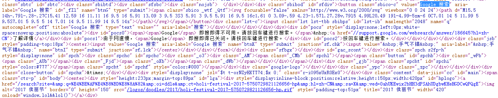
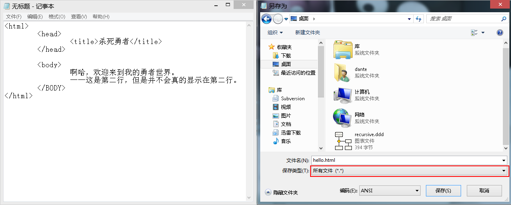
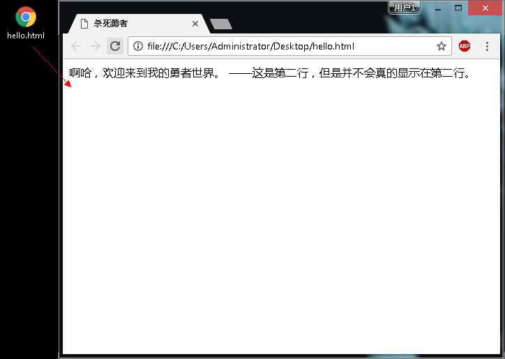
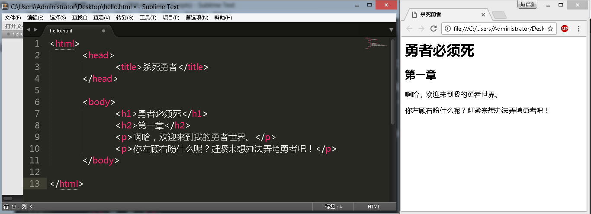
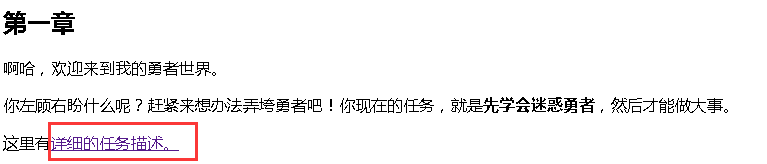
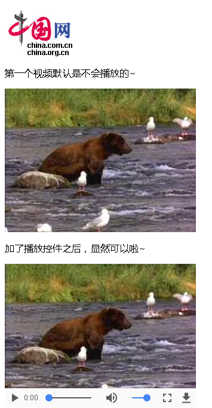

#Chapter6. HTML And JavaScript
这一章，我们依旧需要干掉勇者。但是……这次要更优雅，让他有头有脸死得有尊严。什么叫有头有脸？至少要能在网页上显示他的日常状态吧。什么叫死得有尊严？嗯……就是要大大地几个字出现在你的网页上：勇者死啦。所以，当务之急，就是搞清楚HTML是个什么东西，然后鼓捣个网页出来试试。

##1. 什么是HTML？不就是个网络版的Word文档么！

要谈网页，首先咱们得搞清楚，HTML是个什么东西？HTML是Hyper Text Markup Language（超文本标记语言）的缩写，之所以说它是“超”文本，可能就是翻译的人觉得这样比较酷吧。

在“上古时期”，互联网才刚刚被发明出来的时候，人们都是用文字来传输内容。那么，如果你想传输你刚刚完成的设计稿给你的上司——里面不仅有文字，还有图片，那么，你就需要发送这么一段文字给他：

> 我们的餐厅设计图大概是这样的……
> 插图链接为：“231.100.123.122/img/img2.gif”，请用某工具下载。

如果你要向网上的人展示你的博客，那么你就要告诉他们：
> 标题：我的“旧金山之旅——心路旅程”
> 内容：某日，看到旧金山，哇……
> 插图：xyz服务器下的/123.jpg

当然，这只是举例，事实上那时候还没有那么绚烂的图片可供展示，然而这已经说明了一个问题：在展示信息的时候，单纯的文字太过单调，无法展示多种多样的格式，无法显示一些非文字的内容。比如人们希望能看到标题是加粗的，看到某些内容是自带缩进的，最好还能加入一些“链接”，可以进入到其他页面，而不是手动输入该页面的地址；同时，某些地方可以插入图片，增强内容的感染力。

此时，能不能想办法用一些特殊的文字标记来描述这些内容，似乎就成了当务之急。

比如，我们希望用这样的标记来说明我们的页面插入了一张图片：

```
 某些内容，然后这里插入一张图片： 这里是一张图片</img>。通过这张图片，我们会觉得……
 <button>这里再放个按钮</button>
```

然后，我们希望某些软件打开这些文字的时候，把这些“<>”包裹的内容稍加分析，然后根据对应的规则，去做一些转换：该加图片的，赶紧去对应的地址下载图片；该插入按钮的，赶紧“画”出一个按钮来。

可能此时你已经猜到了，这中格式的文本，就是我们所要说的——HTML。而打开这些格式文本、并做相应转换的软件，后来就演化成了——浏览器。

简而言之，HTML其实就是文本，不过这里的文本多了一些标记，而浏览器会对这些标记进行相应地转换。如果不转换的话，那么你应该可以看到很纯粹的“源代码”:

 

有人会说，啊，其实这跟办公软件Word很像，不是么？嗯，你可以将HTML看做是网络版的Word。而一些脚本编程语言，如js，则可以让HTML的动态效果及其表现力更上一层楼。*当然，如果你掌握了Word的宏功能和VBA，同样可以做出一些动态臃肿的效果。*

##2. HTML的语法格式

HTML的格式很简单，就是用“标签”去标记一些内容。那么，这个“标签”怎么与普通的文字区别开呢？我们可以用尖括号“<标签>”来表示。

但是这个标签影响的范围又从哪里开始，从哪里结束呢？那就用个对应的结束标签符号嘛。

一个最基本的HTML的页面最少应该说明自己是个网页：
```html
<html>
我是网页
</html>
```

如你所见，这就是最大的一个“标签”。有了这个标签，浏览器就会认为这是个网页。

那么，网页里面应该有一些内容吧？还有，你应该看过别人的网页都有“窗口标题”吧？

那么，就需要分两个部分：
 - HEAD：“头部”信息，这里的头部信息一般并不会呈现出来，而是提供给一些搜索引擎、浏览器的内部信息，比如这个网页的“窗口标题”（title）是什么。
 - BODY：“主体”内容，这里的信息一般会呈现给用户看到，比如文字内容、图片、视频等等。

哦，那么就要有对应的标签，于是我们的网页会被扩展成为：

```html
<html>
	<head>
		<title>杀死勇者</title>
	</head>

	<body>
		啊哈，欢迎来到我的勇者世界。
		——这是第二行，但是并不会真的显示在第二行。
	</BODY>
</html>
```

这里的网页代码写哪里？还是控制台吗？不，你需要把这些代码写入到一个文本文件里，然后记得另存为带有html后缀的文件。——在选择类型的时候要注意选择保存为任意文件，然后自行填写后缀名。*附：这里依旧推荐使用Sublime Text 来代替“文本记事本”书写源代码。*



保存后，你会发现在该位置出现了一个网页图标的文件，双击打开它即可看到效果：


简简单单的几个标签，就已经完成了一个网页的制作，而且包含了诸多要点：

 1. 标签一定要成对出现：所谓的成对，就是每个标签总要有对应的结束标签。——尽管现代浏览器已经足够智能，能够识别一些欠缺的标签的结束标签，但是，它也有抽风的时候。

 2. 标签可以包裹新的标签： 标签“html”其实就包裹了所有的标签，它是最顶级的。然后“title”标签一定要放在“head”标签下才能生效，因为窗口标题并不会是“内容”。

 3. 标签并不区分大小写： 不同于我们的JavaScript等编程语言，html的标签可以大小写混用。在这里“body”的结束标签就用了全大写。但是，没有人喜欢大写的标签，因为看起来着实费力。比如“TITLE”就比“title”难识别得多。

4. HTML的源代码可以随意排版，因为内容并不是靠源代码的格式来展现的：这是新手难以接受的一个地方，因为我们在上面源代码的body里，明明在空了一行书写内容，但是，不管你信不信，呈现出来的就是一整行文字。因为事实上……换行也有对应的控制标签的。
这样的好处在于：你可以任意排版你的源代码，比如把所有代码写为一行，只要你的标签对得上号，这是允许的。


那么，在这里，我们写入了些什么内容？
首先，我们在HTML里面写了一个Head部分，并声明了一条再基础不过的消息：这个页面标题叫做“勇者来了”。你可以在预览网页的时候，于浏览器顶部的标签页中看到该文字描述。

然后，我们在body，也就是页面主体里写入了两句话。

如你所见，写HTML页面，更像是在做排版。比如对应的地方，做一些对应的标记，然后就会成为一个可供浏览的页面。为了做好“排版”，我们需要认识更多的标签。

##3. HTML的兄弟姐妹们

###3.1 HTML的常见“文本”
需要隆重介绍的，就是“标题”，和“段落”。这里的标题，是指页面内容加粗、加大的文章标题。

一般而言，文章的标题应该用“headline”（头条、大字标题）来描述，而且文章不仅仅该有大标题，还应该有下一级的标题、下下级的标题、下下下级标题……所以应该有对应的1、2、3级标题来说明。比如这篇教程中，章节名用了一级标题，然后下面的小节部分则用了二级标题。*看着是不是很像Word里面的排版？*

不过，鉴于“headline”这个单词实在是太长了，所以，实际上用缩写h1、h2、h3来描述对应的一级标题、二级标题、三级标题。

嗯，没错，你只需要在页面的主体，也就是我们的第一个网页的body内写入：
```html
<body>
	<h1>勇者必须死</h1>
	<h2>第一章</h2>
	啊哈，欢迎来到我的勇者世界。
	——这是第二行，但是并不会真的显示在第二行。
</body>
```

保存，即可预览到你的网页里有了对应的标题行，而且看起来还是有模有样的。

那么，想换行怎么办？

实际上并不是你想“换行”，而是想有一个新的段落。没错，虽然有换行的标记：
```
<br>这是第二行。br是break，也就是打断上一段落的标记。
```

但是，html目前不推崇使用br标记。因为使用“段落”符号p，更符合html的标签要成对存在的原则，而且会让你的页面源代码看起来更加清爽。现在，我们用段落标记“paragraph”，也就是个“p”来表示某一段文字是属于一个段落，你会发现页面更容易看懂了。赶紧修改一下你的“body”部分：

```html
……之前的内容

<body>
	<h1>勇者必须死</h1>
	<h2>第一章</h2>
	<p>啊哈，欢迎来到我的勇者世界。</p>
	<p>你左顾右盼什么呢？赶紧来想办法弄垮勇者吧！</p>
</body>

……之后的内容
```

看起来是不是很简洁易懂：段落从哪里起止，都已经有成对的```<p>```和```</p>```包裹了。我们的代码，也越来越像Word了，不是吗？

保存你的代码，赶紧预览一下：

 

网页上还有一个常见标签，便是超链接anchor。——当然，这里依旧使用约定俗成的缩写a。（很多缩写……可能都是因为懒吧。）

```
	保存这句话到上述的html中，你会发现<a>这里是会被当成链接的文字</a>，非包裹范围的则不会。
```

但是，链接是要去往哪里？点击那段链接文字后，是要跳转到谷歌，还是百度？此时就需要在开始的标签里填充点详细的描述，我们可以称之为**“属性”**。对应的特征，要有内容，比如这里我们要描述的是链接去哪，就要说明对应的“href”在哪。

*href还是个缩写：Hypertext Reference。晦涩点的意思就是：超文本引用，其实就是我们口头上的“链接”。*

让我们尝试为页面加入一个链接，点击之后去往百度搜索：

```html
……之前的内容

<body>
	<h1>勇者必须死</h1>
	<h2>第一章</h2>
	<p>啊哈，欢迎来到我的勇者世界。</p>
	<p>
	你左顾右盼什么呢？赶紧来想办法弄垮勇者吧！你现在的任务，就是<strong>先学会迷惑勇者</strong>，然后才能做大事。
	</p>
	<p>
	这里有详细的<a href="http://www.baidu.com">任务描述</a>。
	</p>
</body>

……之后的内容
```

保存后预览可以看到效果：

>  

*点点“任务描述”，你会去到哪里？哈哈，强行植入广告去到了百度。——之所以不链接到谷歌，则是因为不可描述的原因，所以该网站“不存在”。另外，你会看到有一块文字被加粗了，看看是因为什么标签引起的呢？*

好了，截至目前，我们已经有了这么多个标签：

| 标签名       | 标签                   | 示例                                                                                          |
|------------|------------------|-----------------------------------------------------------------|
| 标题          | h1、h2、h3……   |  ```<h1>标题要很长</h1>```                                                     | 
| 段落          | p                         | ```<p>段落要有大段文字</p>```                                               |
| 加粗          | strong                 | ```<strong>日常划重点</strong>```                                         |
| 链接          | a                          | ```<a href="去到那个网址？">这段文字要骗你点击</a>```        |

###3.2 HTML的“超文本”：视频和图片

HTML是什么的缩写来着？“超文本标记语言”。可是我们之前说的，好像仅仅是“文本”标记语言，比如文字标题、文字段落、哪一段加粗、哪一块是链接等……更超乎文本的会是什么？

当然是图片、视频。类似的，你也需要给出图片资源、视频资源的来源，也就是“source”——当然，这里HTML采用的是缩写：src。

由此，图片对应的标签是：（出于演示目的，这里的src引用了中国网的logo图片）
```
<image src="http://images.china.cn/images1/ch/2015china/images/logo.gif"></image>
```

视频由于还需要有播放、暂停等默认的“控制”功能，所以需要提供控制属性，所以视频则是：
```
<p>第一个视频默认是能播放的，但是播放按键在哪里？</p>
<video src="http://www.w3school.com.cn/i/movie.ogg"></video>

<p>加了播放控件之后，显然可以啦~</p>
<video src="http://www.w3school.com.cn/i/movie.ogg" controls="controls"></video>
```

*出于演示目的，这里引用了w3school的一处视频，尽管其格式是ogg，但是在现代浏览器下应该都能得到播放支持*

预览一下，此时的效果图应该是：

>  

当然了，这里仅仅是用于举例，如果还需要了解更多的多媒体标签，则需要你多多查阅HTML的标签及其使用方法啦。总而言之，就像Word文档，只要你想到的属性，都可以一一描述出来。

###3.3 HTML的交互元素

HTML也不仅仅是有多媒体的元素，更重要的是体现“交互性”。比如你需要查询某些资料的时候，需要一个“输入框”进行输入；当你输入完毕时，需要一个“按钮”供你点击，这样才能开始你的网上冲浪之旅。

对应的，就有了“输入类型”的元素。——另外，按钮也是一种“输入类型”，尽管它的输入是“用户点击了我”的事件哈。


